# 🪸 GitAquarium Action

> **A GitHub Action that turns your contribution graph into a beautiful, animated deep-sea coral reef ecosystem.**

Your commits grow colorful coral reefs, your stars summon schools of fish, your issue counts regulate water quality, and your merged pull requests place lost treasures on the seabed.



---

## 🐠 How It Works

This action runs on a schedule (or manual dispatch), analyzes your public GitHub stats, and generates a rich, animated vector SVG with beautiful CSS keyframe motions (wiggling fish tails, rising bubbles, waving seaweed, and glowing bioluminescence).

### The Aquarium Mapping

| GitHub Entity | Ecosystem Counterpart |
|---|---|
| 🪸 Weekly Commits | Coral growth (height, branching shape, color) |
| 🐠 Stars | Number of active swimming fish |
| 🪼 Open Issues | Jellyfish population & green algae pollution overlay |
| 🪙 Merged PRs / Closed Issues | Lost treasure chests on the sand bed |
| 🎨 Top Language | Ocean color theme (JS=gold, TS=blue, Python=green, etc.) |
| ⚡ Active Streak | Bioluminescent glow nodes lighting up at night |

---

## 🚀 Setup (2 Steps)

### Step 1: Add the workflow to your profile repository
Create a workflow file in your profile repository (e.g., `Dasmat13/Dasmat13`) at:
`.github/workflows/aquarium.yml`

Paste the following:

```yaml
name: GitAquarium — Update Profile

on:
  schedule:
    - cron: '0 19 * * *'   # Runs daily
  workflow_dispatch:

jobs:
  aquarium:
    runs-on: ubuntu-latest
    permissions:
      contents: write
    steps:
      - uses: actions/checkout@v4

      - name: Generate GitAquarium SVG
        uses: Dasmat13/git-aquarium-action@main
        with:
          github_user_name: ${{ github.actor }}
          github_token: ${{ secrets.GITHUB_TOKEN }}
          svg_out_path: dist/aquarium.svg

      - name: Commit & Push SVG
        run: |
          git config user.name  "github-actions[bot]"
          git config user.email "github-actions[bot]@users.noreply.github.com"
          git add dist/aquarium.svg
          git diff --cached --quiet || git commit -m "🪸 Update GitAquarium [$(date +'%Y-%m-%d')]"
          git push
```

### Step 2: Add to your profile README.md

Add this Markdown image link where you want the aquarium to appear:

```markdown

```

Trigger the Action manually once, and you are done!

---

## 🛠️ Local Development

```bash
git clone https://github.com/Dasmat13/git-aquarium-action.git
cd git-aquarium-action
npm install
npm run build
```

---

## 📄 License

MIT © [Dasmat13](https://github.com/Dasmat13)
